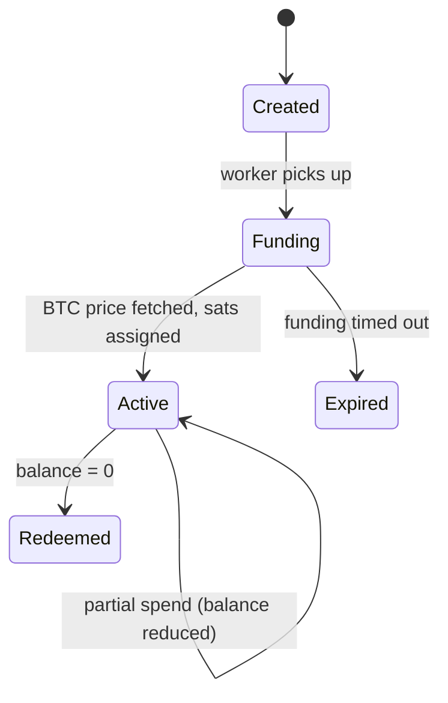
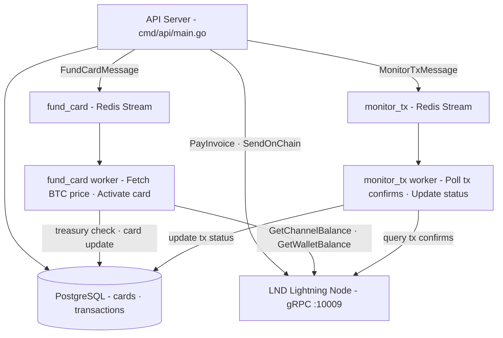
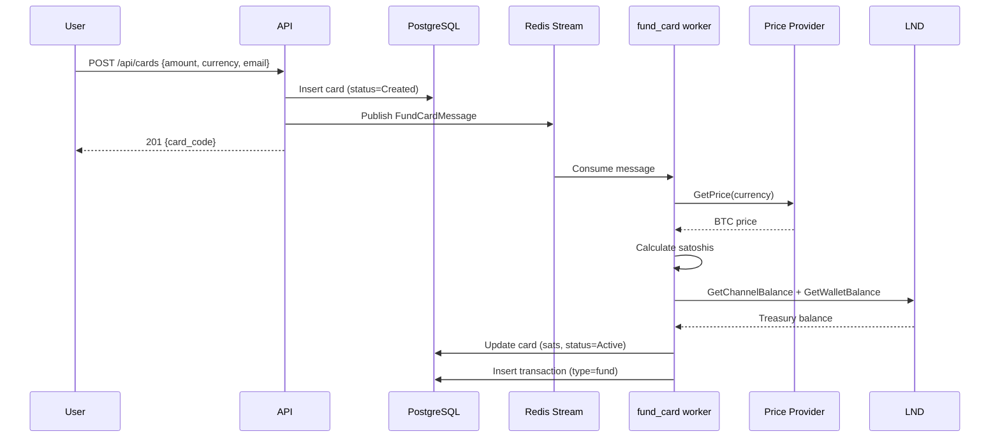
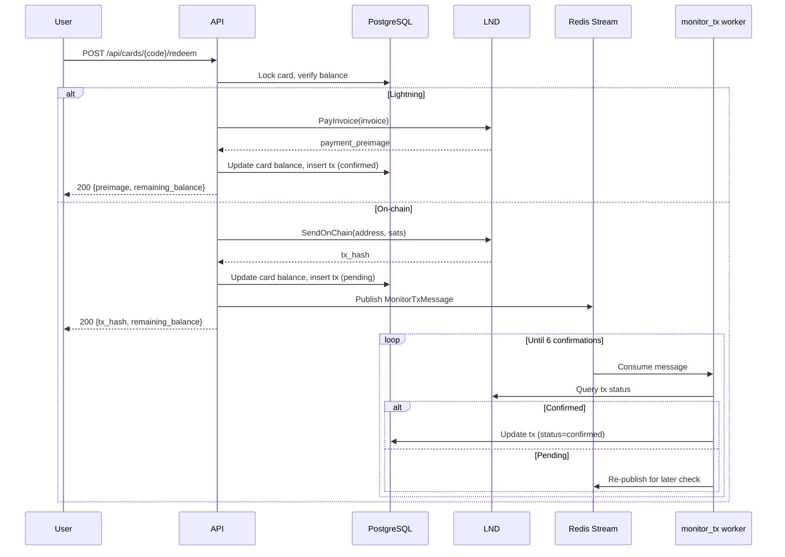

# BTC Gift Card — Bitcoin Gift Card Platform

A custodial Bitcoin gift card service built in Go. Users purchase gift cards with fiat, and the platform holds BTC in a shared treasury (LND Lightning node). Cards are balance claims — BTC only moves when a user redeems via Lightning Network (instant) or on-chain (standard).

---

## How It Works

### For Users

1. **Purchase** — Buy a gift card with fiat (USD/EUR). Receive a unique card code.
2. **Fund** — A background worker fetches the current BTC price and assigns the equivalent satoshi balance to the card.
3. **Redeem** — Provide your card code + a Lightning invoice or Bitcoin address. BTC is sent from the platform treasury directly to you.
4. **Partial Spends** — Cards support multiple redemptions. The balance decreases with each spend until it reaches zero.

### Card Lifecycle



| Status   | Meaning                                     |
|----------|---------------------------------------------|
| Created  | Card saved, awaiting BTC price + funding    |
| Funding  | Worker is calculating sats and activating    |
| Active   | Card has a BTC balance, ready to redeem      |
| Redeemed | Balance is zero, card is fully spent         |
| Expired  | Funding timed out (rare edge case)           |

---

## Architecture

### Custodial Treasury Model

The platform does **not** create a wallet per card. Instead:

- All BTC is held in a single LND Lightning node (channels + on-chain hot wallet).
- Cards are database entries with a `btc_amount_sats` field representing their balance claim on the treasury.
- BTC only leaves the treasury when a user redeems a card.

```
Treasury Balance = LND On-Chain Wallet + LND Channel Balance
Available Balance = Treasury Balance − SUM(unredeemed card balances)
```

### System Components



**API Endpoints:**

| Endpoint | Purpose |
|---|---|
| `POST /api/cards` | Create card |
| `POST /api/cards/{code}/redeem` | Redeem card (Lightning/on-chain) |
| `GET /api/cards/{code}` | Get card details |
| `GET /api/cards/{code}/balance` | Get balance |
| `GET /api/treasury/balance` | Available treasury sats |
| `GET /health` | Health check |

**LND Operations:** PayInvoice, SendOnChain, GetWalletBalance, GetChannelBalance, NewAddress, GetInfo

### Purchase Flow



### Redemption Flow



### Redemption Paths

| Method    | Speed    | Cost        | How                                      |
|-----------|----------|-------------|------------------------------------------|
| Lightning | Instant  | ~1 sat fee  | User provides BOLT11 invoice → LND pays  |
| On-chain  | ~1 hour  | ~500+ sats  | User provides BTC address → LND sends    |

Lightning payments confirm immediately. On-chain payments are tracked by the `monitor_tx` worker until they reach 6 confirmations.

---

## Project Structure

```
btc-giftcard/
├── cmd/
│   ├── api/                    # HTTP API server
│   │   ├── main.go             #   Entrypoint: init infra, start server
│   │   ├── routes.go           #   Router setup + middleware chain
│   │   ├── handlers.go         #   HTTP handlers (card, treasury, health)
│   │   └── middleware.go       #   Logging, recovery, CORS, error helpers
│   ├── worker/
│   │   ├── fund_card/          # Fund card worker
│   │   │   └── main.go         #   Fetch price → calculate sats → delegate to Service.FundCard
│   │   └── monitor_tx/         # Monitor transaction worker
│   │       └── main.go         #   Poll on-chain tx confirmations → update status
│   └── migrate/                # Database migration runner
├── internal/
│   ├── card/                   # Core business logic
│   │   ├── service.go          #   Card lifecycle, treasury, redemption
│   │   └── service_test.go     #   Integration tests
│   ├── lnd/                    # LND gRPC client wrapper
│   │   ├── client.go           #   Connection, TLS, macaroon auth
│   │   ├── lightning.go        #   PayInvoice, DecodeInvoice
│   │   ├── onchain.go          #   SendOnChain, NewAddress, GetWalletBalance
│   │   ├── treasury.go         #   GetChannelBalance, GetInfo
│   │   └── *_test.go           #   47 unit + 7 integration tests
│   ├── database/               # PostgreSQL models + repositories
│   │   ├── model.go            #   Card, Transaction, enums
│   │   ├── card_repository.go  #   CRUD for cards
│   │   └── transaction_repository.go # CRUD for transactions
│   ├── queue/                  # Message definitions
│   │   └── messages.go         #   FundCardMessage, MonitorTransactionMessage
│   ├── exchange/               # BTC/fiat price providers
│   │   └── provider.go         #   Coinbase, CoinGecko, Bitstamp
│   ├── wallet/                 # Bitcoin address validation (btcutil)
│   ├── crypto/                 # AES-256-GCM encryption utilities
│   ├── payment/                # (placeholder) Bank transfer integration
│   └── merchant/               # (placeholder) Merchant payment features
├── pkg/
│   ├── cache/                  # Redis client wrapper (Get/Set/SetNX/Delete/Incr)
│   ├── queue/                  # Redis Streams consumer/producer
│   └── logger/                 # Zap structured logging
├── config/                     # Config structs + TOML loader
├── config.toml                 # App configuration
├── docker-compose.yml          # PostgreSQL, Redis, LND containers
├── migrations/                 # SQL migration files
└── lnd-creds/                  # TLS cert + macaroon (git-ignored)
```

---

## Database Schema

### Cards

| Column               | Type      | Description                                |
|----------------------|-----------|--------------------------------------------|
| id                   | UUID PK   | Card identifier                            |
| user_id              | UUID NULL | Optional link to a user account            |
| purchase_email       | TEXT      | Buyer's email (for delivery + verification)|
| owner_email          | TEXT      | Current owner's email                      |
| code                 | TEXT UQ   | Redemption code (e.g. GIFT-XXXX-YYYY-ZZZZ)|
| btc_amount_sats      | BIGINT    | Remaining balance in satoshis              |
| fiat_amount_cents    | BIGINT    | Face value in cents                        |
| fiat_currency        | TEXT      | USD or EUR                                 |
| purchase_price_cents | BIGINT    | Total charged (including fees)             |
| status               | TEXT      | created / funding / active / redeemed / expired |
| created_at           | TIMESTAMP | Card creation time                         |
| funded_at            | TIMESTAMP | When balance was assigned                  |
| redeemed_at          | TIMESTAMP | When balance reached zero                  |

### Transactions

| Column             | Type      | Description                                  |
|--------------------|-----------|----------------------------------------------|
| id                 | UUID PK   | Transaction identifier                       |
| card_id            | UUID FK   | Associated card                              |
| type               | TEXT      | fund / redeem / payment                      |
| redemption_method  | TEXT NULL | lightning / onchain                          |
| tx_hash            | TEXT NULL | On-chain transaction hash                    |
| payment_hash       | TEXT NULL | Lightning payment hash                       |
| payment_preimage   | TEXT NULL | Lightning proof of payment                   |
| lightning_invoice   | TEXT NULL | BOLT11 invoice string                        |
| from_address       | TEXT NULL | Source address                               |
| to_address         | TEXT NULL | Destination address                          |
| btc_amount_sats    | BIGINT    | Amount in satoshis                           |
| status             | TEXT      | pending / confirmed / failed                 |
| confirmations      | INT       | On-chain confirmation count                  |
| created_at         | TIMESTAMP | Transaction creation time                    |
| broadcast_at       | TIMESTAMP | When transaction was broadcast               |
| confirmed_at       | TIMESTAMP | When transaction was confirmed               |

---

## Redis Usage

| Key Pattern              | Purpose                              | TTL  |
|--------------------------|--------------------------------------|------|
| `treasury:available_sats`| Cached treasury balance              | 10s  |
| `treasury:lock`          | Distributed lock for treasury writes | 5s   |
| `card:lock:{code}`       | Per-card lock (concurrent redemption)| 10s  |
| `fund_card` stream       | Queue for card funding messages      | —    |
| `monitor_tx` stream      | Queue for tx monitoring messages     | —    |

---

## Configuration

All settings are in `config.toml` and can be overridden with environment variables:

```toml
[database]
host = "localhost"
port = "5432"
user = "postgres"
password = "postgres"
db = "btcgifter"

[redis]
host = "localhost"
port = "6379"

[lnd]
grpc_host = "localhost"
port = "10009"
tls_cert_path = "./lnd-creds/tls.cert"
macaroon_path = "./lnd-creds/admin.macaroon"
network = "testnet"
payment_timeout_seconds = 30
max_payment_fee_sats = 100
```

---

## Getting Started

### Prerequisites

- Go 1.24+
- Docker & Docker Compose
- LND credentials (TLS cert + macaroon)

### 1. Start Infrastructure

```bash
docker compose up -d   # PostgreSQL, Redis, LND
```

### 2. Copy LND Credentials (first time only)

```bash
./scripts/copy-lnd-creds.sh
```

Then set `tls_cert_path` and `macaroon_path` in `config.toml`.

### 3. Run the API Server

```bash
go run ./cmd/api
```

### 4. Run the Workers

```bash
# In separate terminals:
go run ./cmd/worker/fund_card
go run ./cmd/worker/monitor_tx
```

### 5. Run Tests

```bash
go test ./...                     # All tests
go test ./internal/lnd/... -v     # LND tests (47 unit)
go test ./internal/card/... -v    # Card service tests
```

---

## Development

```bash
go fmt ./...          # Format code
go vet ./...          # Static analysis
go test ./... -v      # Run all tests
go build ./...        # Build everything
```

### Build Binaries

```bash
go build -o bin/api ./cmd/api
go build -o bin/fund-worker ./cmd/worker/fund_card
go build -o bin/monitor-worker ./cmd/worker/monitor_tx
```
